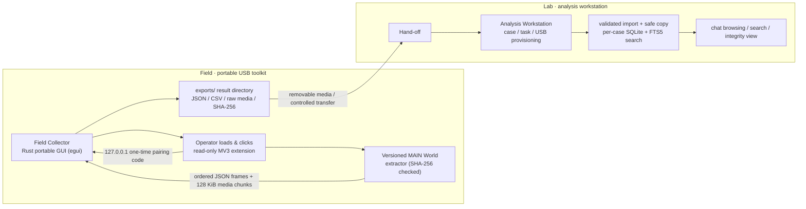

# WhatsApp Web Forensic Collection & Analysis System (WAFC)

A **rapid forensic collection and assisted-analysis system for WhatsApp Web** based on JS
injection — a quasi-production research prototype for **authorized sessions only**.
This is a graduation design project composed of two fully independent software products that
collaborate through a versioned evidence format.

> **Forensic stance**: an auditable, reproducible quasi-production research prototype. It does
> not claim judicial or commercial forensic certification, and is intended solely for **read-only
> collection and analysis of authorized** WhatsApp Web sessions.

## Products

| Product | Directory | Role | Tech stack |
|---|---|---|---|
| **Field Collector** | [`FieldCollector/`](FieldCollector/) | Portable, no-install, on-site read-only collection and evidence export | Rust (egui) + MV3 browser extension + MAIN World extractor |
| **Analysis Workstation** | [`AnalysisWorkstation/`](AnalysisWorkstation/) | Case management, task provisioning, result import and chat preview | Electron + pnpm monorepo (domain / evidence-repository / workstation-core) |

The two products keep independent builds, versions and releases and have **no runtime coupling or
mutual installation requirement**. The field side carries no case database, visualization or
reporting capability; the analysis side never controls a browser or performs WhatsApp injection.

## Architecture



## Key features

- **Read-only collection**: attaches to the operator's currently open, signed-in WhatsApp Web
  page via `activeTab` + `debugger` temporary grants, over a loopback channel secured with a
  one-time pairing code;
- **Layered extractor**: the stable MV3 extension only handles authorization and bounded
  forwarding; the versioned MAIN World extractor reads WhatsApp's private models; the Rust host
  handles streaming writes, deduplication and validation;
- **Data coverage**: 22 categories including messages, contacts, chats, communities, channels,
  statuses, calls, polls, receipts, events, media and avatars, each recorded with a
  `supported` / `unavailable` capability status;
- **Media handling**: `ReadableStream` / Blob chunks are streamed to disk in 128 KiB blocks,
  content-addressed and deduplicated across chats (one physical object per SHA-256), with
  explicitly marked `preview` references kept when originals fail;
- **Integrity**: messages are deduplicated by native ID and each chat gets a history completeness
  report; "everything" only means what the current client can observe, never an account-level
  absolute guarantee;
- **Case management** (Workstation): case creation, examiner/keys/tasks, full USB provisioning and
  in-place updates, automatic reception, structural validation, read-only archiving and derived
  indexes;
- **Portable task mode**: with a valid `task.json` next to the executable, Field Collector pins
  the sibling `extension\` and `results\` directories and exports `field-collector-session/6`.

## Repository layout

```text
WhatsApp-Forensics/
├─ AnalysisWorkstation/        # Analysis workstation (Electron + pnpm monorepo)
│  ├─ apps/desktop/            #   desktop app (main / preload / renderer)
│  └─ packages/
│     ├─ domain/               #   domain model
│     ├─ evidence-repository/  #   evidence repository & search
│     └─ workstation-core/     #   case, task, USB and import core
├─ FieldCollector/             # Field collection tool
│  ├─ src/                     #   Rust host (transport / acquisition / storage / viewer)
│  ├─ extension/               #   MV3 read-only extension
│  ├─ extractor/               #   MAIN World extractor (assembled into an IIFE at build time)
│  ├─ scripts/                 #   build & test scripts
│  └─ exports/                 #   collection output
├─ tmp/                        # planning docs, reference implementations, sample data
│  ├─ plan/                    #   graduation design plan & progress review
│  ├─ 原型归档/                 #   ZAPiXWEB / ShowMesssage exploratory prototypes
│  ├─ reference-wa-js/         #   reference implementations (research only, not runtime deps)
│  └─ 案例数据/                 #   sample collected data
├─ LICENSE                     # AGPL-3.0-only
└─ README.md
```

## Quick start

### Field Collector

```powershell
cd .\FieldCollector
npm run build        # build extension & extractor
npm test
cargo test --locked
cargo run --locked
```

First run: load `FieldCollector\extension\dist` at `chrome://extensions`, open and sign in to
`https://web.whatsapp.com/`, start the Rust program, enter the one-time pairing code into the
extension, then fill in the evidence item name and start collection.
See [`FieldCollector/README.md`](FieldCollector/README.md) for details.

### Analysis Workstation

```powershell
cd .\AnalysisWorkstation
pnpm install
pnpm check
pnpm dev
```

The Windows x64 portable build uses `pnpm package:portable`, which compiles Field Collector and
the extension first and then bundles the fixed payload into the Workstation resources.
See [`AnalysisWorkstation/README.md`](AnalysisWorkstation/README.md) for details.

## Documentation

- [`FieldCollector/README.md`](FieldCollector/README.md) — collector capabilities, data flow,
  output structure and safety boundaries
- [`AnalysisWorkstation/README.md`](AnalysisWorkstation/README.md) — workstation scope and
  development / build notes
- [`tmp/plan/`](tmp/plan/) — graduation design plan and week-by-week progress review
- [`THIRD_PARTY_NOTICES.md`](FieldCollector/THIRD_PARTY_NOTICES.md) — third-party dependencies and
  license notices

## Safety & compliance boundaries

- The extension only requests `activeTab`, `debugger` and `clipboardRead`; the clipboard is read
  only after a user click, with the tab origin re-checked;
- The extension only accepts a fixed set of Runtime commands and argument shapes; it exposes no
  arbitrary JavaScript execution interface;
- The loopback channel listens on `127.0.0.1` only and requires a 10-digit one-time pairing code;
- Collection may trigger WhatsApp read receipts, cache and network side effects — it is an
  observable read-only boundary, not side-effect free;
- This is a functional verification prototype: it does not include case authorization, evidence
  signing, encrypted sealing or production-scale guarantees.

## License

New code is licensed under **AGPL-3.0-only** (see [`LICENSE`](LICENSE)). The extraction approach
references the GPL-3.0 ZAPiXWEB archive kept in this repository, which is research material only
and not a runtime dependency; attribution is documented in
[`THIRD_PARTY_NOTICES.md`](FieldCollector/THIRD_PARTY_NOTICES.md).
